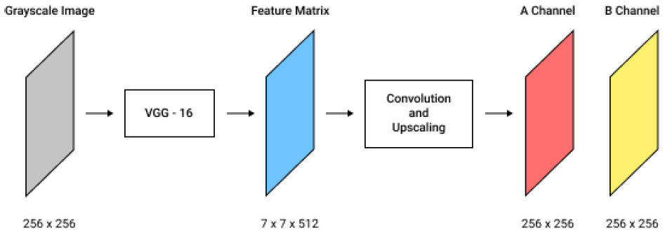
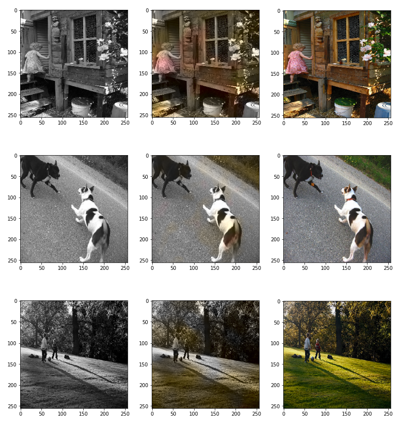

# Image Colorization

Image Colorization project as a part of CS - 304 (Computational Intelligence) course's final project

## Problem Statement

Given a grayscale image (I), generate a plausible colorized version.

## Clone this repository

```bash
git clone https://github.com/kushaangowda/Image_Colorization.git
```

## Methodology



The encoder consists of pretrained model VGG-16, used to extract image features from grayscale images of dimensions 256 x 256. The feature matrix generated by VGG16 is of dimensions 7 x 7 x 512.

This is followed by a deconvolution network, which consists of multiple convolutional and upscaling layers, to generate the values for A and B channels. This network consists of a series of Conv2D and Upscaling2D layers. We used Adam optimizer, and Mean Squared Error loss function.

## Dataset

We used the [Flickr8k](https://www.kaggle.com/datasets/hsankesara/flickr-image-dataset) dataset, which contains 8,091 color photos, and converted them into grayscale images.

## Predictions (Grayscale, Prediction, Original)



## Team Members

[Kushaan Gowda](https://github.com/kushaangowda) \
[Abhinav Reddy](https://github.com/pixelbullet) \
[Khajjayam Abhiram](https://github.com/Abhiram0201)
